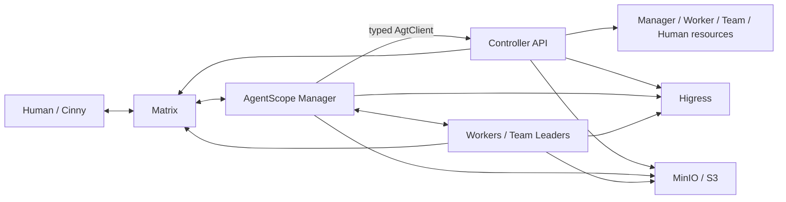

# AgentTeams Manager Architecture

AgentTeams separates conversational decisions from deterministic orchestration.
The Manager uses AgentScope 2.0, while the Controller remains the authority for
resource lifecycle and deployment.

## Components

| Component | Responsibility | Runtime/image |
|---|---|---|
| Controller | REST API and reconciliation for Manager, Worker, Team, Human, Matrix, storage, and gateway state | Go; `agentteams-controller` or embedded controller image |
| Manager | Matrix conversation, policy-bound tools, durable workflows, recovery, scheduling, delegation | AgentScope 2.0.4.post1; `agentteams-manager` |
| Workers | Execute delegated work; one replaceable runtime per Worker/Team member | OpenClaw, CoPaw, Hermes, QwenPaw, or OpenHuman images |
| Matrix/Cinny | Human and agent rooms, messages, threads, membership, media | Tuwunel/Synapse plus Cinny |
| Higress | OpenAI-compatible model routes, MCP, consumers, service publishing | managed or existing gateway |
| MinIO/S3/OSS | journals, snapshots, prompts, tasks, projects, files | managed MinIO or compatible object storage |

OpenClaw, CoPaw, Hermes, QwenPaw, and OpenHuman are Worker runtimes. They are
not Manager fallback runtimes.

## Control and data flow



One Matrix event becomes one room-scoped AgentScope turn:

1. the Matrix adapter validates sender, room, relation, and E2EE state;
2. the policy resolver chooses a fixed tool set for that room;
3. `reply_stream` runs with the room's persisted `AgentState`;
4. typed tools call deterministic workflows;
5. mutation intent is journaled before an external effect;
6. the workflow verifies convergence and returns a typed receipt;
7. the session is persisted and the reply is sent to Matrix.

The model does not own retries, idempotency, cron scheduling, credentials, or
external-state reconciliation.

## Authority boundaries

| Authority | State |
|---|---|
| Controller | desired and observed resource state |
| Matrix | rooms, members, messages, threads, media |
| Higress | model/MCP/service routes and consumers |
| Object storage | immutable recovery journal, snapshots, artifacts |
| SQLite WAL | active Manager sessions and transactional indexes |

Local SQLite is appropriate because there is one active Manager writer. It
provides transactions, WAL reads, and consistent backup without introducing a
Redis service. Object storage supplies remote durability and restart recovery.

## Durable mutation protocol

Mutation workflows use stable operation IDs derived from the Matrix event and
tool call. A normal operation is:

```text
planned -> prepared -> external effect -> acknowledged -> verified -> succeeded
```

Timeouts are ambiguous, not failures. Startup restores the latest checksummed
SQLite snapshot, replays newer immutable events, and reconciles unfinished
operations against Controller, Matrix, Higress, Git, and storage facts.

## Runtime configuration

The Controller publishes a secret-free `agentscope-manager.json` document to
object storage. It includes the model, prompt object keys, MCP descriptors,
heartbeat settings, and revision. The Manager validates and prepares the new
document, then swaps it between turns. Active turns keep their original model
and tools.

Manager identity follows the same desired-state path:

```text
Admin confirmation
  -> update_manager_identity
  -> Manager.spec.identity
  -> Controller merges the SOUL identity section
  -> higher runtime revision
  -> between-turn hot reload
```

## Authorization

Tools are selected from Controller topology and Matrix room type. Admin DM,
Worker, Leader, Project, Human/channel, and unknown rooms receive different
tool sets. Mutating tools require a confirmation continuation unless trusted
YOLO mode was explicitly enabled. Approval requests are stored globally in
SQLite, sent to the Admin DM, and resume the original room's AgentScope
continuation after `/confirm <id>` or `/deny <id>`. `/status` lists pending
requests and `/reset <id>` cancels one and releases its parked room. Tool
invocation rechecks the same policy.

Secrets do not enter model prompts, SQLite, MinIO journals, runtime documents,
or Worker CRs. The Controller injects the GitHub MCP token only into the
Manager process and reconciles it into Higress; AgentScope sees a secret-free
MCP descriptor.

## Deployment shapes

### Embedded Docker/Podman

The embedded Controller container runs the Go Controller plus Higress,
Tuwunel, MinIO, and Cinny. It creates a separate lightweight
`agentteams-manager` container and separate Worker containers. Host persistence
is mounted into the Manager at `/var/lib/agentteams-manager`.

### Kubernetes

The Helm chart installs Controller and infrastructure workloads, then creates
the bootstrap Manager CR. Reconcilers create Manager and Worker Pods. The
Manager CRD accepts only `runtime: agentscope`; Worker and Team member CRDs
accept `openclaw`, `copaw`, `hermes`, `qwenpaw`, and `openhuman`.

## Skills and verification

The 16 image-owned Manager skills live under `manager/agent/skills/`. Skills
are guidance; registered typed tools are the executable boundary. The complete
mapping and test evidence is maintained in
[`tests/manager-skill-parity.json`](../tests/manager-skill-parity.json).

See also:

- [Manager guide](manager-guide.md)
- [Quickstart](quickstart.md)
- [Declarative resource management](declarative-resource-management.md)
