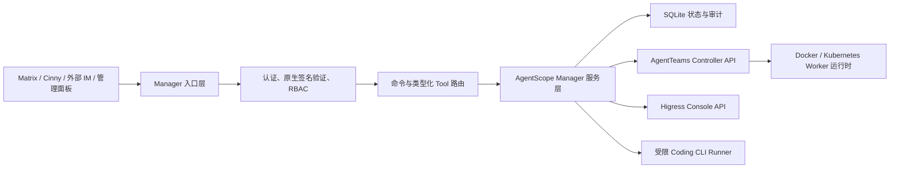

# AgentTeams 全功能对齐设计

日期：2026-07-28  
状态：已批准执行  
基线：`agentscope-ai/AgentTeams@785c2db56a02c0635a66bba490ad0f6f327c790a`

## 目标

在不恢复旧 OpenClaw/CoPaw Manager、不恢复 OpenHuman Worker 的前提下，让新的 AgentScope 2.0 Manager 覆盖上游 AgentTeams 的管理能力，并补齐以下八项差异：

1. Fork 自己可发布、可安装、可追溯的版本与镜像链路。
2. Discord、Telegram、Slack、飞书、WhatsApp、Signal、钉钉的原生入站验证与出站发送。
3. 与原版一致的常用 IM 斜杠命令。
4. 可创建、修改、删除 Worker、Team、Project 的管理面板。
5. CoPaw Worker Web Console 的显式启用和关闭。
6. v1.2 以前镜像使用旧环境变量前缀的安装兼容。
7. Manager 委托 Claude、Gemini、Qoder CLI 执行编码任务。
8. Manager 对 Higress Provider、AI Route、Consumer 的通用管理。

本设计把“功能对齐”和“实现相同”分开：用户行为、权限边界和运维结果对齐原版；内部继续使用 AgentScope 2.0、类型化服务、SQLite、Controller API 和 Kubernetes。

## 已选择的实现路线

### 方案 A：复制原版 Manager 运行时和脚本

优点是短期表面最接近上游。缺点是重新引入 OpenClaw/CoPaw Manager、脚本式状态和两套运行时，直接违背项目已经确定的 AgentScope 2.0 架构，因此不采用。

### 方案 B：在 AgentScope Manager 内实现同等能力

每一项能力都通过类型化请求模型、服务层、权限校验、确认机制和审计记录接入现有 Manager。原版的 shell/curl 技能只保留为用户意图说明，不作为执行引擎。该方案沿用现有架构、可测试、可审计，是本次采用的方案。

### 方案 C：保留 AgentScope Manager，再加旧 Manager/转发器侧车

优点是适配速度快，缺点是身份、状态、确认和故障边界会被拆成两套，Kubernetes 部署也更复杂，因此不采用。

## 总体架构



所有写操作遵循同一条规则：

- 先验证调用者身份和角色。
- 高风险或破坏性操作进入现有 confirmation 流程。
- 使用幂等键避免重复执行。
- 通过服务层写入，不允许管理页面或聊天适配器直接改 SQLite、CRD 或容器。
- 密钥只通过环境变量引用或 Kubernetes Secret 注入，不在响应、日志和审计详情中回显。

## 1. 发布和镜像链路

### 设计

- GitHub Actions 使用 `GITHUB_TOKEN` 登录 GHCR，构建项目当前实际存在的 Manager、Controller、Worker 和前端镜像。
- 删除 OpenHuman 的构建、测试、发布目标；CI 必须拒绝再次引用已经删除的目标。
- 标签发布把相同版本号写入所有自有镜像，同时生成 Helm 包和安装脚本资产。
- 安装器默认查询 `jesseedcp/AgentTeams` 的 release；允许通过 `AGENTTEAMS_RELEASE_REPOSITORY` 覆盖。
- 自有镜像默认来自 Fork 的 GHCR 命名空间；`AGENTTEAMS_REGISTRY` 仍可覆盖，方便私有镜像仓库和国内镜像代理。
- 未发布标签时，源码安装明确使用当前提交构建，不悄悄退回官方 AgentTeams 镜像。

### 兼容和安全

- 上游基础设施镜像只有在项目没有自有替代品时才继续使用，并固定可审计版本。
- CI 增加“安装器最终镜像来源”测试，确保默认值不会指向 `agentscope-ai` 的发行资产。
- 本次提交准备发布链路，但不擅自创建 GitHub Release 或版本标签。

## 2. 外部聊天渠道

### 配置模型

`ExternalChannelDocument` 增加：

- `provider`：现有六种加 `dingtalk`。
- `mode`：`native` 或 `relay`。新配置默认 `native`；旧配置自动迁移为 `relay`。
- `credentials`：只保存环境变量名，不保存明文。
- `options`：API 基址、应用 ID、机器人 ID 等非密钥选项。

### 原生协议

- Telegram：校验 `X-Telegram-Bot-Api-Secret-Token`，解析 Update，通过 Bot API 发送。
- Slack：校验时间窗和 `X-Slack-Signature`，处理 URL challenge，通过 `chat.postMessage` 发送。
- WhatsApp：校验 Meta `X-Hub-Signature-256`，支持 GET 验证 challenge，通过 Graph API 发送。
- 飞书：校验 verification token，处理 challenge；支持签名校验。启用加密事件时使用配置的 encrypt key 解密。
- 钉钉：校验机器人回调签名/时间戳，解析 conversation 与 sender，通过机器人或 OpenAPI 返回。
- Discord：校验交互请求签名并处理 PING；消息发送使用 Bot API。需要持续 Gateway 事件的部署可使用现有 relay 模式，避免把长连接生命周期塞进 HTTP 健康服务。
- Signal：官方没有统一的托管 Bot Webhook；继续提供明确标记的 relay 模式，适配 signal-cli-rest-api 等部署。

每个适配器各自实现验证、归一化和发送，不能再用一个自定义 HMAC 冒充平台原生协议。原有 `x-agentteams-signature` 仅在 `relay` 模式保留。

### 防护

- 拒绝过期时间戳、签名不匹配、超大正文和未知 content type。
- 使用恒定时间比较；可用的事件 ID 进入去重表。
- 平台 challenge 不创建联系人或会话。
- 未信任联系人仍沿用 pending/trusted/blocked 流程。

## 3. IM 斜杠命令

### 命令集合

- 会话：`/new`、`/reset`、`/compact`、`/status`。
- 模型：`/model`、`/model status`、`/model list`、`/models`、`/model <序号|provider/model>`。
- 帮助：`/help`、`/commands`。
- 运行控制：`/stop`。
- 推理显示：`/think`、`/reasoning`、`/verbose`。
- 权限策略：`/elevated`。
- 排队策略：`/queue`。

### 运行行为

- 设置写入 SQLite session settings；Manager 重启后仍保留。
- `/model` 只重建当前房间的 Agent 实例并恢复对话状态，不清空上下文。
- `/stop` 走控制快路径，直接取消当前房间正在执行的 AgentScope turn，不能排在长任务之后。
- `/think` 改变后续模型请求的 thinking 参数；不支持该参数的模型返回明确提示。
- `/reasoning` 控制是否把可公开的 reasoning summary 发给用户，不泄露隐藏推理。
- `/verbose` 控制工具执行摘要和进度消息。
- `/elevated` 只调整确认策略，永远不能让普通成员获得管理员权限，也不能绕过强制确认操作。
- `/queue` 调整当前房间的队列模式和上限；已经接收的事件保持顺序。

未知命令返回简短帮助，不再作为普通提示词发送给模型。

## 4. 完整管理面板

### API

在 `/manager-admin/api` 下增加版本化写接口：

- `POST/PATCH/DELETE /v1/workers`
- `POST/PATCH/DELETE /v1/teams`
- `POST/PATCH/DELETE /v1/projects`
- 对应的 `GET` 列表和详情接口

请求和返回复用 Manager 工具层的 Pydantic 模型。HTTP 层只负责认证、正文大小、JSON 解析和错误映射，实际操作调用现有 service。

### 权限

- 只接受 Manager 管理员 bearer token。
- 删除、重建等操作要求请求体 `confirmed: true`，服务层仍应用 confirmation 策略。
- 严格 content type、正文大小限制和稳定的 JSON error envelope。
- 管理 UI 不保存 token；使用当前会话输入，并只在内存中持有。

### UI

保持无额外前端构建依赖的管理页，加入：

- Worker、Team、Project 的创建和编辑表单。
- 删除前的资源名二次确认。
- 操作状态、字段错误和审计/confirmation ID 的可见反馈。
- 只读 overview、runtime、heartbeat 继续保留。

## 5. CoPaw Worker Console

### 数据模型

Worker CRD 增加：

```yaml
spec:
  console:
    enabled: false
    port: 8088
```

Controller、Go API、CLI、Python Client 和 AgentScope Tool 使用同一个字段。旧对象没有该字段时等同于关闭。

### 行为

- 仅 CoPaw/QwenPaw 兼容运行时允许启用；其他 Worker 返回类型化校验错误。
- 启用时 Controller 写入 `AGENTTEAMS_CONSOLE_PORT` 并滚动更新 Worker。
- 关闭时删除该环境变量并滚动更新，不仅仅是隐藏端口。
- Docker 后端按现有方式映射本机端口；Kubernetes 后端由 Worker Service/`expose` 控制网络可达性。
- Manager 提供 `set_worker_console`，并在结果中返回 enabled、container port 和可用的访问地址。

这与原版“重建容器以应用开关”的结果一致，但配置存进声明式 Worker 资源，重启 Controller 后不会丢失。

## 6. 旧版本升级兼容

安装器根据最终选定的镜像版本选择 Controller 环境变量前缀：

- `< 1.2.0`：旧前缀。
- `>= 1.2.0`：`AGENTTEAMS_`。

Bash 和 PowerShell 共用相同的规范化规则：

- 去除 `v` 前缀。
- 忽略预发布和构建元数据后比较主版本、次版本、修订号。
- 非法或无法判断的版本采用当前前缀并显示警告，避免误入旧模式。

兼容逻辑只影响升级/指定旧镜像，不改变新安装的 AgentScope Manager。加入上游同等场景的安装器测试。

## 7. Coding CLI 委托

### 执行模型

增加 `CodingCLIClient` 和 `CodingCLIDelegationService`：

1. 管理员选择 `claude`、`gemini` 或 `qodercli`。
2. 服务验证功能开关、CLI allowlist、任务归属和 confirmation。
3. 使用现有 processing lease 独占任务。
4. 把任务工作区同步到隔离目录。
5. 用固定可执行文件和固定参数模板启动进程；用户内容通过 stdin 传入，不能拼接 shell。
6. 限制时间、输出大小和可访问工作目录。
7. 生成结果摘要，按现有 Git delegation 规则同步允许的产物并发送 Matrix 通知。
8. 无论成功、失败或取消都释放 lease 并记录 operation journal。

### 部署

- 默认关闭；通过显式配置启用，并配置允许的 CLI。
- 官方 Manager 镜像只提供执行框架和探测，不把第三方 CLI 凭据烘焙进镜像。
- 运维者可用派生镜像或受控 volume 将 CLI 安装到固定 PATH；健康/管理 API 显示每个 CLI 的 available 状态。
- 恢复精简的 `skills-alpha/coding-cli-management` 和 Worker `coding-cli` 说明，全部调用类型化工具，不执行任意 shell。

## 8. Higress 通用管理

扩展现有 Higress Client 和 AgentScope tools，覆盖：

- AI Provider：list/get/create-or-update/delete。
- AI Route：list/get/create-or-update/delete。
- Consumer：list/get/create-or-update/delete。

设计要求：

- 使用 Pydantic 类型校验，不暴露通用任意路径请求工具。
- Secret 使用 `SecretStr`/环境引用，响应和审计中自动脱敏。
- 删除、密钥轮换和路由覆盖需要 confirmation。
- 写操作带幂等键；网络重试只对幂等读取或带幂等键的写入启用。
- 恢复精简的 `skills-alpha/higress-gateway-management`，说明资源关系和 Manager 工具，不复制上游数千行 Console API 文档。

## 数据迁移

- SQLite 使用增量 migration 为 session settings、外部事件去重和必要的 operation metadata 增列/建表。
- 外部渠道旧配置检测到 `outbound_url/token_env/webhook_secret_env` 时自动映射到 `relay`，启动时输出一次迁移警告。
- Worker CRD 新字段可选，旧资源无需批量修改。
- 安装器旧前缀兼容只在选择旧镜像时生效。

## 测试策略

### 单元与合约

- 每项功能先写失败测试，再写实现。
- 平台 Webhook 使用官方示例形状和本地生成签名，覆盖有效、无效、过期、challenge、重复事件。
- 命令覆盖解析、持久化、取消快路径、权限与 Agent 重建。
- Admin API 覆盖认证、方法、schema、confirmation 和 CRUD service 调用。
- Go 覆盖 CRD/API/CLI/Controller console 字段传播。
- 安装器覆盖版本比较、旧/新前缀、Fork release URL 和默认镜像来源。
- CI 静态检查禁止 OpenHuman 构建目标与官方发行源回流。

### 集成

- Python 全量测试、Go 全量测试、静态分析、Helm lint/template。
- 使用临时 SQLite 和假 Controller/Higress/CLI 运行端到端服务测试。
- Kubernetes 部署后验证 Manager、Cinny、Matrix、Controller、四种保留 Worker、Console 开关和 Admin CRUD。
- Matrix 真实房间验证 `/model`、`/stop`、confirmation 和至少一个 Manager tool round-trip。

### 上游差异报告

parity fixture 必须忠实描述官方上游：旧 Manager 运行时、五个 Worker（含 OpenHuman）及其技能。报告把以下内容分开：

- 已实现的行为对齐。
- 有意替换：AgentScope 2.0 Manager、Cinny、SQLite。
- 有意删除：OpenHuman。
- 外部条件：未安装第三方 Coding CLI、未提供平台密钥时功能显示 unavailable，而不是宣称已验证在线平台。

## 完成条件

- 八项功能都有实现、测试和用户文档。
- 默认安装不会拉官方 AgentTeams Manager 镜像。
- CI 不引用 OpenHuman，不存在失效 Make target。
- 外部原生协议与 relay 模式明确区分。
- 所有新写操作有认证、权限、确认和审计。
- 本地全量测试通过，Helm 渲染通过。
- 当前 Kubernetes 环境部署新镜像并通过健康检查和关键行为验证。
- 使用 Lore 格式提交到当前 `main`，推送到 `jesseedcp/AgentTeams.git`；不引入上游旧 Git 历史，不创建新分支。
