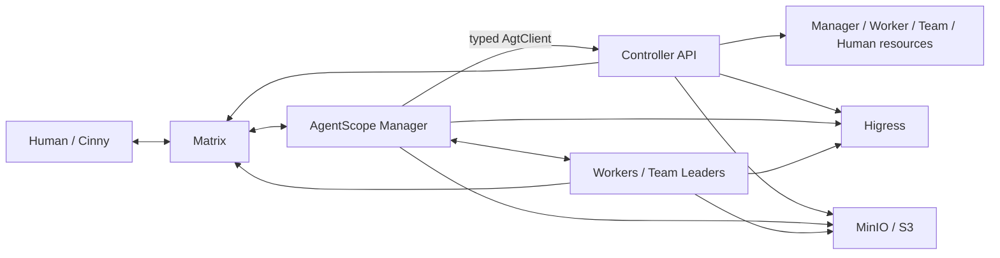

# AgentTeams Manager 架构

AgentTeams 把对话决策和确定性编排分开。Manager 使用 AgentScope 2.0，
Controller 继续作为资源生命周期和部署的权威系统。

## 组件

| 组件 | 职责 | 运行时/镜像 |
|---|---|---|
| Controller | Manager、Worker、Team、Human、Matrix、存储和网关状态的 REST API 与协调 | Go；`agentteams-controller` 或嵌入式 Controller 镜像 |
| Manager | Matrix 对话、房间权限工具、持久工作流、恢复、调度、委派 | AgentScope 2.0.4.post1；`agentteams-manager` |
| Workers | 执行被委派的工作；每个 Worker/Team 成员使用一个可替换运行时 | OpenClaw、CoPaw、Hermes 或 QwenPaw |
| Matrix/Cinny | 人与 Agent 的房间、消息、线程、成员和媒体 | Tuwunel/Synapse 与 Cinny |
| Higress | OpenAI 兼容模型路由、MCP、Consumer、服务发布 | 托管或已有网关 |
| MinIO/S3/OSS | 日志、快照、prompt、任务、项目和文件 | 托管 MinIO 或兼容对象存储 |

OpenClaw、CoPaw、Hermes 和 QwenPaw 都是 Worker 运行时，
不是 Manager 的回退运行时。

## 控制流与数据流



一条 Matrix 事件会形成一个房间范围的 AgentScope 回合：

1. Matrix 适配器校验发送者、房间、relation 和 E2EE 状态；
2. 权限解析器为该房间选择固定工具集合；
3. `reply_stream` 使用该房间持久化的 `AgentState`；
4. typed 工具调用确定性工作流；
5. 外部副作用前先记录变更意图；
6. 工作流验证收敛并返回 typed receipt；
7. 保存会话并向 Matrix 发送回复。

重试、幂等、cron 调度、密钥和外部状态恢复不由模型决定。

## 权威边界

| 权威系统 | 状态 |
|---|---|
| Controller | 资源的期望和观测状态 |
| Matrix | 房间、成员、消息、线程、媒体 |
| Higress | 模型/MCP/服务路由和 Consumer |
| 对象存储 | 不可变恢复日志、快照和产物 |
| SQLite WAL | 活跃 Manager 会话和事务索引 |

系统只有一个活跃 Manager 写入者，因此本地 SQLite 能提供事务、WAL 读取和
一致备份，无需引入 Redis 服务。对象存储负责远端耐久性和重启恢复。

## 持久化变更协议

工作流使用由 Matrix 事件和工具调用派生的稳定 operation ID。正常流程是：

```text
planned -> prepared -> external effect -> acknowledged -> verified -> succeeded
```

超时表示结果不确定，而不是确定失败。启动时会恢复最新的带校验 SQLite
快照、重放之后的不可变事件，再根据 Controller、Matrix、Higress、Git 和
存储事实收敛未完成操作。

## 运行时配置

Controller 向对象存储发布无密钥的 `agentscope-manager.json`，其中包含模型、
prompt 对象 key、MCP 描述、心跳设置和 revision。Manager 先校验并准备新文档，
再在回合之间切换；活跃回合保持原模型和工具。

Manager 身份也使用同一条期望状态路径：

```text
管理员确认
  -> update_manager_identity
  -> Manager.spec.identity
  -> Controller 合并 SOUL 身份区段
  -> 更高 runtime revision
  -> 回合间热加载
```

## 权限

工具根据 Controller 拓扑和 Matrix 房间类型选择。管理员私聊、Worker、
Leader、Project、Human/频道和未知房间获得不同工具集合。变更工具默认要求
确认 continuation，除非明确启用了可信 YOLO 模式。实际调用时还会再次检查
权限。

密钥不会进入模型 prompt、SQLite、MinIO journal、运行时文档或 Worker CR。
Controller 只把 GitHub MCP token 注入 Manager 进程并协调到 Higress；
AgentScope 接收的是无密钥 MCP 描述。

## 部署形态

### 嵌入式 Docker/Podman

嵌入式 Controller 容器运行 Go Controller、Higress、Tuwunel、MinIO 和
Cinny，并创建独立的轻量 `agentteams-manager` 与 Worker 容器。宿主机
持久化目录挂载到 Manager 的 `/var/lib/agentteams-manager`。

### Kubernetes

Helm 安装 Controller 和基础设施工作负载，然后创建 bootstrap Manager CR。
Reconciler 创建 Manager/Worker Pod。Manager CRD 只接受
`runtime: agentscope`；Worker 和 Team 成员 CRD 接受 `openclaw`、`copaw`、
`hermes`、`qwenpaw`。

## Skills 与验证

16 项镜像内置 Manager skill 位于 `manager/agent/skills/`。Skill 是行为指导，
已注册 typed 工具才是可执行边界。完整映射和测试证据位于
[`tests/manager-skill-parity.json`](../../tests/manager-skill-parity.json)。

相关阅读：

- [Manager 指南](manager-guide.md)
- [快速开始](quickstart.md)
- [声明式资源管理](declarative-resource-management.md)
